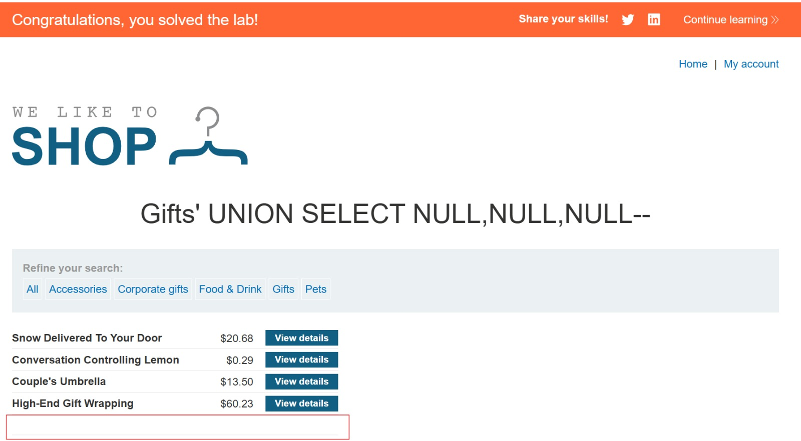

# Lab: SQL injection UNION attack, determining the number of columns returned by the query

## Explanation
The main goal of this lab was to determine how many columns the original query returns by using a UNION-based SQL injection attack. This is a crucial first step before extracting data.

## Solution
First, I tested the category parameter with `'+UNION+SELECT+NULL--` which produced an error. Then, I incrementally added NULL values: `'+UNION+SELECT+NULL,NULL--` and `'+UNION+SELECT+NULL,NULL,NULL--` until the error disappeared. When I used three NULL values, the application returned a normal response, confirming the query returns 3 columns.

The backend query looks like this:
```sql
SELECT column1, column2, column3 FROM products WHERE category='Gift' UNION SELECT NULL,NULL,NULL--'
```

UNION requires both queries to have the same number of columns. By testing with NULL values, I can determine the correct column count without knowing column names or types.

## Result


