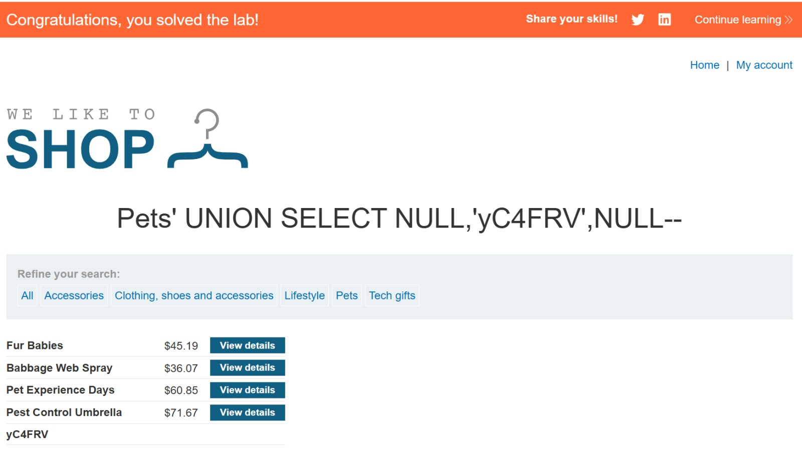

# Lab: SQL injection UNION attack, finding a column containing text

## Explanation
The main goal of this lab was to identify which column in the query can hold string data. After determining the number of columns, I needed to find which column accepts text values to successfully inject and display specific data.

## Solution
First, I determined the query returns 3 columns using `'+UNION+SELECT+NULL,NULL,NULL--`. Then, I tested each column with a string value to find which accepts text. I tried `'+UNION+SELECT+'a',NULL,NULL--`, then `'+UNION+SELECT+NULL,'a',NULL--`, and finally `'+UNION+SELECT+NULL,NULL,'a'--`. The application required me to make a specific string appear, so I used the provided value in the text-compatible column.

```sql
SELECT column1, column2, column3 FROM products WHERE category='Pets' UNION SELECT NULL,'yC4FRV',NULL--'
```
By replacing NULL with string values in each position, I can determine which columns accept text data. This is essential for extracting string data like usernames or passwords in later attacks.

## Result



